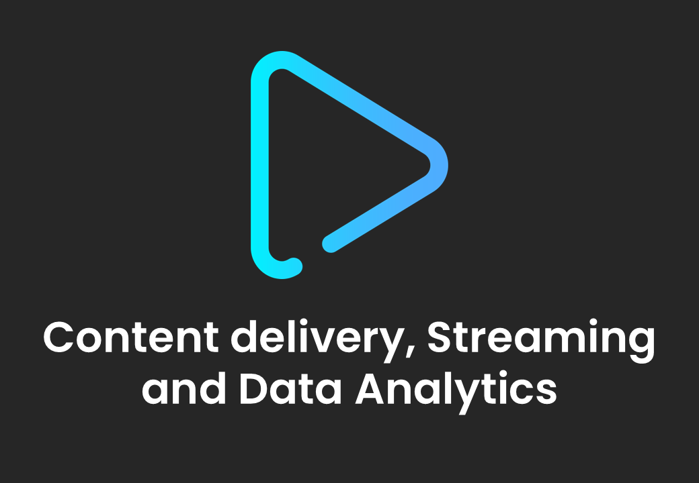
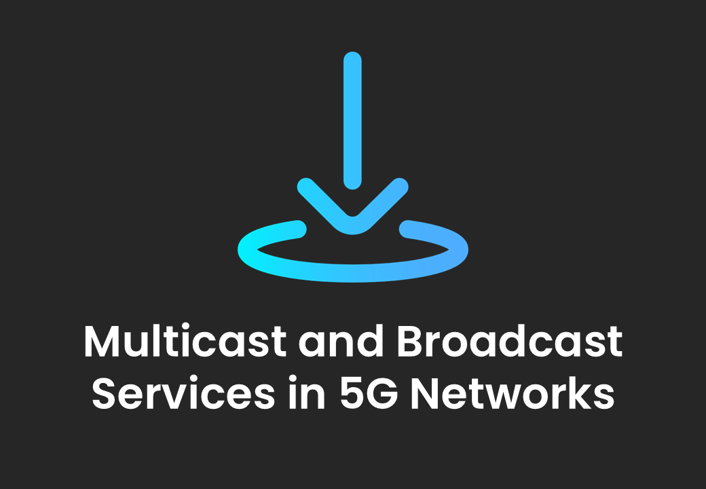
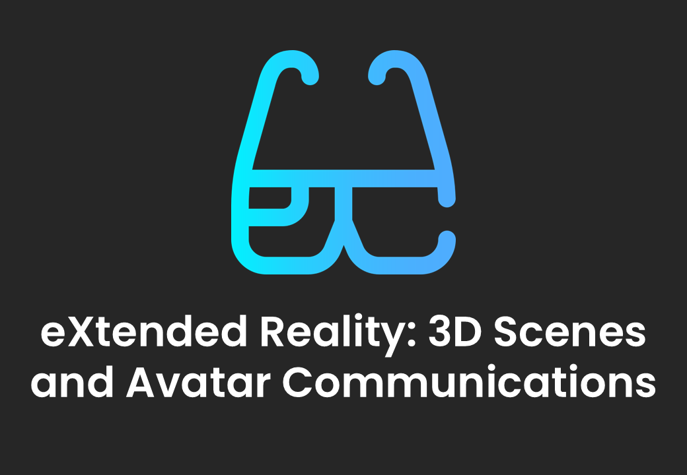
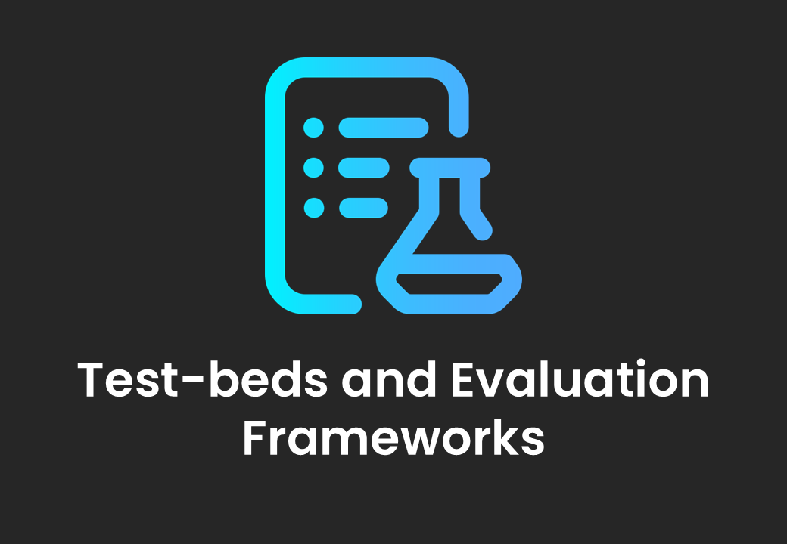
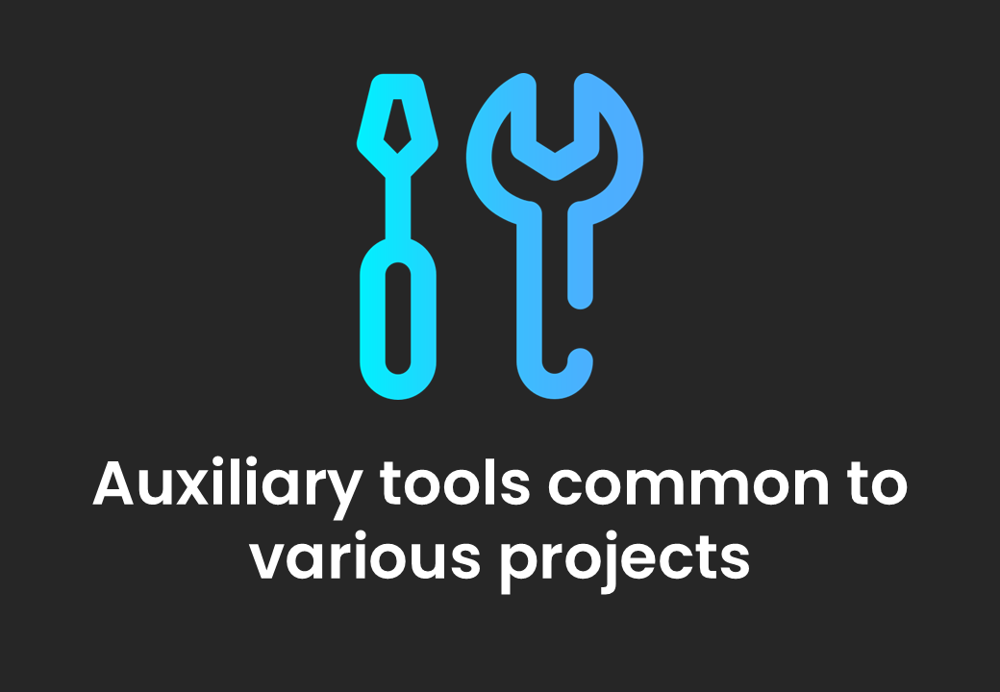
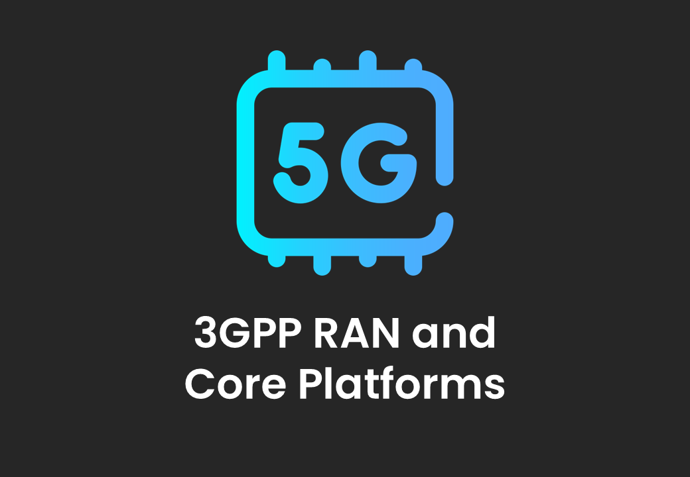
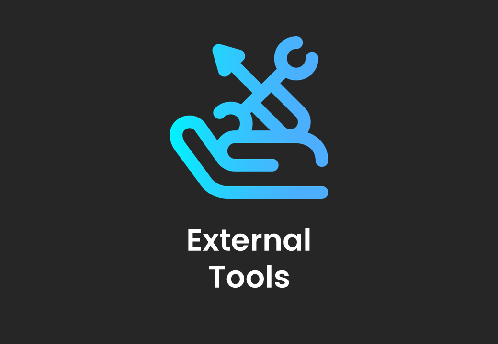

 

[All the Projects](./pages/projects.html){: .btn .btn-blue } [Join us and Contribute!](#join-us-and-contribute){: .btn .btn-blue } [Public Monthly Call](./pages/public-call.html){: .btn .btn-blue } [Releases](./pages/releases.html){: .btn .btn-release }

# Learn more about the 5G-MAG Reference Tools

[Download an overview about the 5G-MAG Reference Tools](https://hub.5g-mag.com/Getting-Started/docs/Reference_Tools_Overview.pdf){: .btn .btn-blue }

Today’s media and connectivity specifications are ultimately realized through code, and our goal is to accelerate that journey from the drafting table to the developer’s toolkit.

The <b>5G-MAG Reference Tools Developer Community</b> provides a structured environment where software development and specification work move in sync. We:

<ul>
  <li><b>Make Technology Accessible:</b> We put the latest innovations directly into the hands of developers, lowering entry barriers for product development.</li>
  <li><b>Ensure Quality:</b> We use software implementations to provide early feedback, ensuring specifications are tested and ready for the real world.</li>
  <li><b>Drive Global Adoption:</b> Through open-source software and tutorials, we empower users and creators to adopt and scale new technologies with confidence.</li>
</ul>

# What are the focus areas of the projects?

<table width="80%">
  <tr>
    <td markdown="span" align="center"><a href="./pages/projects.html#content-delivery-streaming-and-data-analytics"><a/></td>
    <td markdown="span" align="center"><a href="./pages/projects.html#5g-broadcast-for-tv-radio-and-emergency-alerts"><a/></td>
    <td markdown="span" align="center"><a href="./pages/projects.html#multicast-and-broadcast-services-in-5g-networks"><a/></td>
  </tr>
  <tr>
    <td markdown="span" align="center"><a href="./pages/projects.html#content-delivery-streaming-and-data-analytics"><b>Content delivery, Streaming and Data Analytics</b></td>
    <td markdown="span" align="center"><a href="./pages/projects.html#5g-broadcast-for-tv-radio-and-emergency-alerts"><b>5G Broadcast for TV, Radio and Emergency Alerts</b></td>
    <td markdown="span" align="center"><a href="./pages/projects.html#multicast-and-broadcast-services-in-5g-networks"><b>Multicast and Broadcast Services in 5G Networks</b></td>
  </tr>
    <td> </td>
  <tr>
    <td markdown="span" align="center"><a href="./pages/projects.html#extended-reality-xr-3d-scenes-and-avatar-communications"><a/></td>
    <td markdown="span" align="center"><a href="./pages/projects.html#volumetric-video-and-beyond-2d-video-experiences"><a/></td>
    <td markdown="span" align="center"><a href="./pages/projects.html#test-beds-and-evaluation-frameworks"><a/></td>
  </tr>
  <tr>
    <td markdown="span" align="center"><a href="./pages/projects.html#extended-reality-xr-3d-scenes-and-avatar-communications"><b>eXtended Reality (XR): 3D Scenes and Avatar Communications</b></td>
    <td markdown="span" align="center"><a href="./pages/projects.html#volumetric-video-and-beyond-2d-video-experiences"><b>Volumetric Video and Beyond 2D Video Experiences</b></td>
    <td markdown="span" align="center"><a href="./pages/projects.html#test-beds-and-evaluation-frameworks"><b>Test-beds and Evaluation Frameworks</b></td>
  </tr>
    <td> </td>
  <tr>
    <td markdown="span" align="center"><a href="./pages/projects.html#auxiliary-tools-common-to-various-projects"><a/></td>
    <td markdown="span" align="center"><a href="./pages/projects.html#3gpp-ran-and-core-platforms"><a/></td>
    <td markdown="span" align="center"><a href="./pages/projects.html#external-tools"><a/></td>
  </tr>
  <tr>
    <td markdown="span" align="center"><a href="./pages/projects.html#auxiliary-tools-common-to-various-projects"><b>Auxiliary tools common to various projects</b></td>
    <td markdown="span" align="center"><a href="./pages/projects.html#3gpp-ran-and-core-platforms"><b>3GPP RAN and Core Platforms</b></td>
    <td markdown="span" align="center"><a href="./pages/projects.html#external-tools"><b>External Tools</b></td>
  </tr>
</table>

# How can I join and contribute?

[Guidelines for Contributors: Learn How to Contribute](./pages/guidelines-contributors.html){: .btn .btn-blue }
[Guidelines for Contributors: The Open-Source Software Licenses](./pages/guidelines-contributors.md#the-open-source-software-licenses){: .btn .btn-blue }

<table>
  <tr>
    <td width="65%" align="center" valign="top">
      
    </td>
    <td width="35%" align="center" valign="middle">
      
    </td>
  </tr>
</table>

{: .note }
Please refer to the [Getting-Started](https://github.com/5G-MAG/Getting-Started/) repository to provide updates to this documentation.
