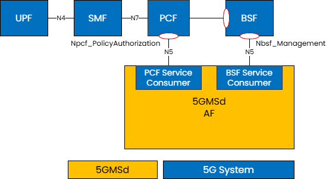
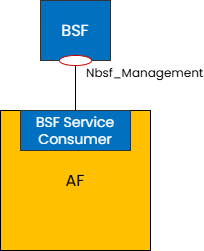
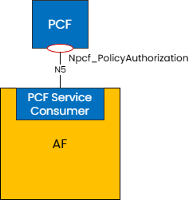
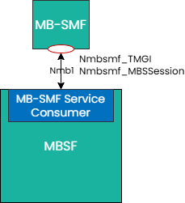
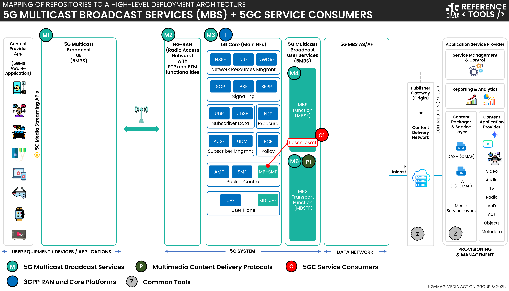

 

[Scope](./scope.html){: .btn .btn-blue } [Project Roadmap](./projects.html){: .btn .btn-blue } [GitHub Repos](./repositories.html){: .btn .btn-github } [Releases](../releases.html#project-5g-core-service-consumers){: .btn .btn-release } [Tutorials](./tutorials.html){: .btn .btn-blue } [Requirements](./requirements.html){: .btn .btn-blue }

# Scope

The 5G Core presents several Network Functions, each of which has its own set of service interfaces. This project hosts a collection of reusable service consumer libraries designed to talk to the 5G Core Network Functions using some of these service interfaces.

## What is being implemented? 

{: .inshort }
A series of reusable service consumer libraries to invoke service operations on various 5GC network functions.

Within the context of 5G Media Streaming, the 5GMS AF needs to communicate with the 5G Core in order to manipulate network Quality of Service (QoS) for ongoing media streaming sessions.

The following libraries are available:
* **libscbsf** - Binding Support Function (BSF) service consumer library
* **libscpcf** - Policy Control Function (PCF) service consumer library

Within the context of 5G Multicast/Broadcast Services (MBS), the Multicast/Broadcast Session Management Function (MB-SMF) is responsible for allocating and deallocating Temporary Mobile Group Identities (TMGIs) and for the management of Multicast/Broadcast Services on the Multicast/Broadcast User Plane Function (MB-UPF).

The following libraries are available:
* **libscmbsmf** - Multicast/Broadcast Session Management Function (MB-SMF) service consumer library

## Where can I find references to specifications?

A list of relevant specifications can be found in the link below.

[Specifications](https://hub.5g-mag.com/Standards/pages/5g-core-service-consumers.html){: .btn .btn-blue }

# In more details

## libscbsf - Binding Support Function (BSF) service consumer library

<table style="width: 100%">
  <tr>
    <td align="center" style="width:20%"><a/></td>
    <td align="left">
      <ul>
        <li>Responsible for maintaining a mapping between UE PDU Session and the PCF which is managing that PDU Session.</li>
        <li>The <code>libscbsf</code> library aids in discovery of the BSF in the 5G Core (by interrogating the NRF) and subsequently looking up which PCF is managing the PDU Session for a UE, identified by its IP address.</li>
        <li>This library implements the service consumer end of the following service-based APIs:
          <ul>
            <li><code>Nbsf_Management</code></li>
          </ul>
        </li>
      </ul>   
    </td>
  </tr>
</table>

## libscpcf - Policy Control Function (PCF) service consumer library

<table style="width: 100%">
  <tr>
    <td markdown="span" align="center" style="width:20%"><a/></td>
    <td align="left">
      <ul>
        <li>Responsible for applying charging and network policy to the PDU sessions of UEs. The <code>Npcf_PolicyAuthorization</code> service API is used at reference point N5 by an Application Function (AF) to request policy changes to the PDU session on behalf of the UE. This allows an Application Function to manipulate particular network QoS parameters for selected IP traffic flows within the PDU session.</li>
        <li>The <code>libscpcf</code> library allows an application to connect to a PCF and request an <code>AppSessionContext</code> which it can then use to manipulate the network routing policies for traffic passing across specific application flows within a UE's PDU Session.</li>
        <li>This library implements the service consumer end of the following service-based APIs:
          <ul>
            <li><code>Npcf_PolicyAuthorization</code></li>
          </ul>
        </li>
      </ul>  
    </td>
  </tr>
</table>

## libscmbsmf - Multicast/Broadcast Session Management Function (MB-SMF) service consumer library

<table style="width: 100%">
  <tr>
    <td markdown="span" align="center" style="width:20%"><a/></td>
    <td align="left">
      <ul>
        <li>Responsible for allocating and deallocating Temporary Mobile Group Identities (<code>TMGIs</code>) and for the management of Multicast/Broadcast Services (<code>MBS</code>) on the Multicast/Broadcast User Plane Function (<code>MB-UPF</code>).</li>
        <li>The <code>Nmbsmf_TMGI</code> service API is used at reference point <code>Nmb1</code> for the allocation and deallocation of <code>TMGIs</code>, and the <code>Nmbsmf_MBSSession</code> service API is used to reference point <code>Nmb1</code> for the creation, modification and destruction of MBS Sessions and for the management of notification subscriptions to events arising on those MBS Sessions.</li>
        <li>The <code>libscmbsmf</code> library provides a simple create/destroy interface for <code>TMGI</code> management and an MBS Session and notifications subscriptions model for management of MBS Sessions.</li>
        <li>This library implements the service consumer end of the following service-based APIs:
          <ul>
            <li><code>Nmbsmf_TMGI</code></li>
            <li><code>Nmbsmf_MBSSession</code></li>
          </ul>
        </li>
      </ul>
    </td>
  </tr>
</table>

## 5G Downlink Media Streaming (5GMSd) with 5GC Service Consumers

[5G Media Streaming: Repositories](../5g-media-streaming/repositories.html){: .btn .btn-5gms }
[5GC Service Consumers: Repositories](../5g-core-service-consumers/repositories.html){: .btn .btn-5gcsc }
[3GPP RAN and Core Platforms: Repositories](../3gpp-ran-and-core-platforms/repositories.html){: .btn .btn-3gpp }
[Common Tools: Repositories](../common-tools/){: .btn .btn-common }

## 5G Multicast Broadcast Services (MBS) with 5GC Service Consumers

[5G Multicast Broadcast Services: Repositories](../5g-multicast-broadcast-services/repositories.html){: .btn .btn-5mbs }
[Multimedia content delivery protocols: Repositories](../multimedia-content-delivery/repositories.html){: .btn .btn-md }
[5GC Service Consumers: Repositories](../5g-core-service-consumers/repositories.html){: .btn .btn-5gcsc }
[3GPP RAN and Core Platforms: Repositories](../3gpp-ran-and-core-platforms/repositories.html){: .btn .btn-3gpp }
[Common Tools: Repositories](../common-tools/){: .btn .btn-common }
