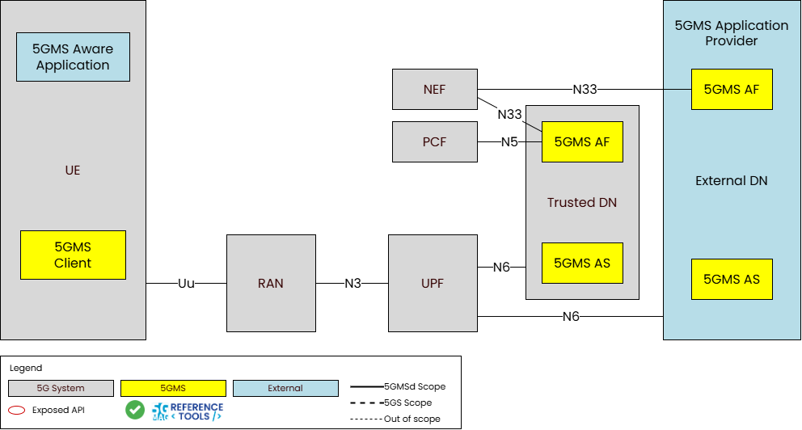
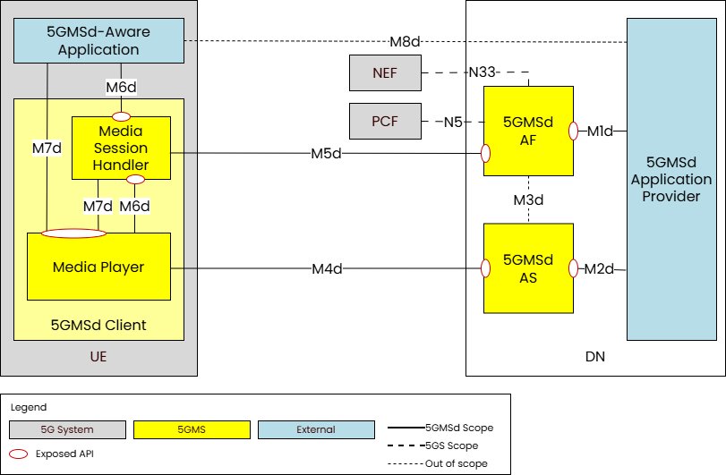
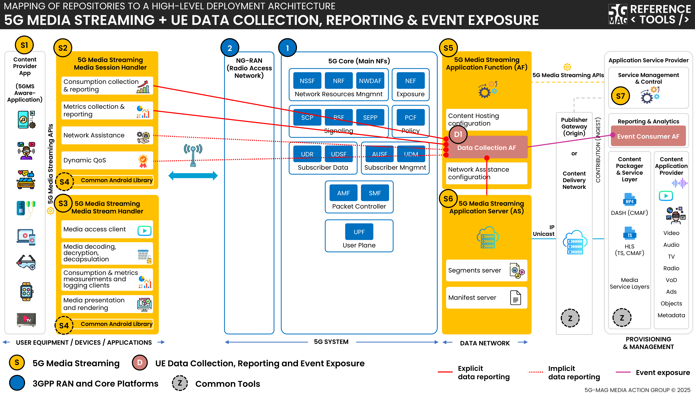
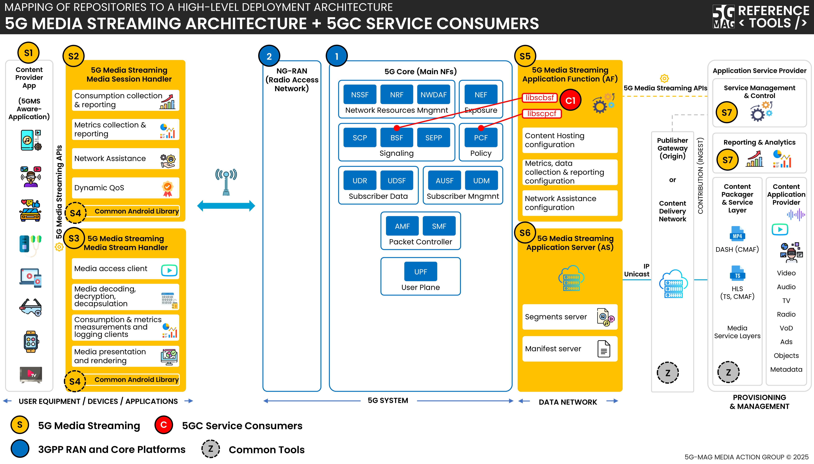
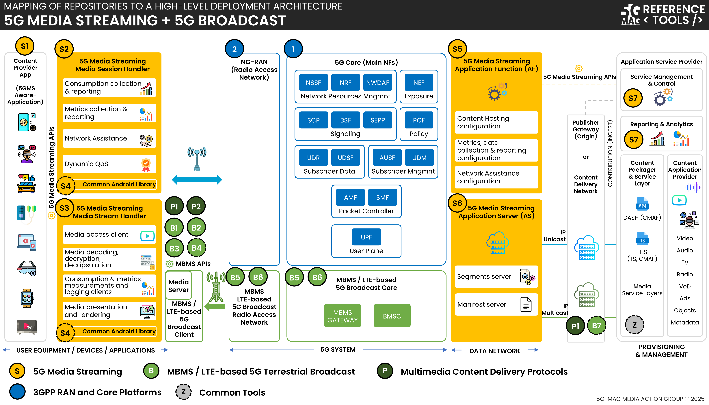

 

[Scope](./scope.html){: .btn .btn-blue } [Project Roadmap](./projects.html){: .btn .btn-blue } [GitHub Repos](./repositories.html){: .btn .btn-github } [Releases](../releases.html#project-5g-media-streaming){: .btn .btn-release } [Tutorials](./tutorials.html){: .btn .btn-blue } [Requirements](./requirements.html){: .btn .btn-blue }

# Scope

## 5G Media Streaming - An overview

In the context of 3GPP standards, 5G Media Streaming (5GMS) is defined as a framework designed to enable high-quality, efficient delivery of media. The architecture supports services from mobile network operators and third parties including both Downlink (5GMSd) and Uplink (5GMSu) Media Streaming. The 5GMS architecture is functionally divided into independent components enabling deployments with various degrees of integration between 5G MNOs and Content Providers.

5GMS is not a separate network but a functional extension of the standard 5G System Architecture. It is the bridge that allows 5G networks to move away from being a "data pipe" and instead become an active, optimized platform for professional and user-generated media content.

The main functional entities are:

* **5GMS Application Provider**: The entity that uses the 5G network to deliver content. It provides a 5GMS Aware-Application on the UE to make use of 5GMS Client and network functions via 5GMS interfaces and APIs.

* **5GMS Application Function (5GMS AF)**: A specialized application function dedicated to the management and optimization of media streaming sessions.

* **5GMS Application Server (5GMS AS)**:  A specialized application server which primary job is to store, cache, and deliver media content to the User Equipment (UE) or to receive and ingest media from the UE

* **5GMS Client**: The functional part of the user's device (UE) that handles the media session and the player/streamer logic.

A list of relevant specifications can be found in the link below.

[Specifications](https://hub.5g-mag.com/Standards/pages/5g-media-streaming.html){: .btn .btn-blue }

## What is being implemented? 

{: .inshort }
The functional entities of 5G Media Streaming, instantiated for 5G Unicast Downlink Media Streaming (5GMSd), including support for various of the features specified.

### 5G Unicast Downlink Media Streaming (5GMSd)

[Check this Tutorial to deploy 5GMSd end-to-end](./tutorials/end-to-end.html){: .btn .btn-blue }

[Check this Tutorial to deploy 5GMSd end-to-end including a 5G Network](./tutorials/end-to-end-with-5g.html){: .btn .btn-blue }

[Obtain the code in GitHub](./repositories.html){: .btn .btn-github }

To deliver downlink streaming services, the network is the origin of the media and the UE acts as the consumption device.
 

The main functional entities are:

* **5GMSd Application Provider**: The external entity responsible for the "source" side of the media—creating, encoding, and formatting the content. It utilizes 5GMSd interfaces to deliver this media to the user's application.

* **5GMSd AS**: The hosting environment for media content. It can be a single server or a distributed network, such as a Content Delivery Network (CDN), to optimize delivery.

* **5GMSd AF**: The control-plane entity providing management functions to the device’s Media Session Handler and the Application Provider. It also acts as the bridge to the 5G Core, interacting with the PCF or NEF.

* **5GMSd Client**: The primary receiver on the device for downlink streaming services. It can be implemented with exposing APIs (M6d/M7d) for external use or as a self-contained entity where those interfaces are internal. It consists of two sub-components:

  * **Media Session Handler**: The "control brain" on the device. It coordinates with the 5GMSd AF to set up and manage sessions while gathering data like Quality of Experience (QoE) and consumption metrics.

  * **Media Player**: The "data engine" on the device. It communicates with the 5GMSd AS to fetch and play the actual media stream. It provides playback controls to the app and session status to the Session Handler.

* **5GMSd-Aware Application**: An external app (e.g., a streaming service) that holds the provider's specific logic. Uses standardized APIs to initiate and manage media sessions.

The 5GMSd Client may include several subfunctions which are depicted below:

<table>
  <tr>
    <td markdown="span" align="center" style="width:40%"><a/></td>
    <td markdown="span" align="center" style="width:40%"><a/></td>
  </tr>
  <tr>
    <td markdown="span" align="center">Subfunctions of the Media Player</td>
    <td markdown="span" align="center">Subfunctions of the Media Session Handler</td>
  </tr>
</table>

The interfaces are:

| Interface | Name | Description |
| :--- | :--- | :--- |
| **M1d** | **5GMSd Provisioning API** | External API exposed by the **5GMSd AF**; allows the Application Provider to configure the system for downlink streaming and receive feedback. |
| **M2d** | **5GMSd Ingest API** | Optional external API exposed by the **5GMSd AS**; used for uploading content when the AS is hosted within a trusted Data Network. |
| **M3d** | Internal Interface | An **unspecified internal API** used for information exchange between the 5GMSd AF and AS regarding content hosting. |
| **M4d** | **Media Streaming APIs** | The primary data-plane APIs exposed by the **5GMSd AS** to the **Media Player** for streaming media content. |
| **M5d** | **Media Session Handling API** | Control-plane APIs between the **5GMSd AF** and **Media Session Handler** for session control, QoE reporting, and security (auth/auth). |
| **M6d** | **UE Media Session Handling APIs** | Internal UE APIs that allow the **5GMSd-Aware App** and the **Media Player** to access 5GMS session functions. |
| **M7d** | **UE Media Player APIs** | Internal UE APIs used by the **5GMSd-Aware App** and **Session Handler** to control playback and media engine functions. |
| **M8d** | **Application API** | An external interface for "service-level" exchange (like metadata or login) between the **App** and the **Provider**. This is **not specified** by 3GPP. |

The 5G Core presents several Network Functions, each of which has its own set of service interfaces. This project hosts a collection of reusable service consumer libraries designed to talk to the 5G Core Network Functions using some of these service interfaces.

A list of relevant specifications can be found in the link below.

[Specifications](https://hub.5g-mag.com/Standards/pages/5g-core-service-consumers.html){: .btn .btn-blue }

## What is being implemented? 

{: .inshort }
A series of reusable service consumer libraries to invoke service operations on various 5GC network functions.

Within the context of 5G Media Streaming, the 5GMS AF needs to communicate with the 5G Core in order to manipulate network Quality of Service (QoS) for ongoing media streaming sessions.

The following libraries are available:
* **libscbsf** - Binding Support Function (BSF) service consumer library
* **libscpcf** - Policy Control Function (PCF) service consumer library

## libscbsf - Binding Support Function (BSF) service consumer library

[Obtain the code in GitHub](./repositories.html){: .btn .btn-github }

* Responsible for maintaining a mapping between UE PDU Session and the PCF which is managing that PDU Session.
* The `libscbsf` library aids in discovery of the BSF in the 5G Core (by interrogating the NRF) and subsequently looking up which PCF is managing the PDU Session for a UE, identified by its IP address.
* This library implements the service consumer end of the following service-based APIs:
  * `Nbsf_Management`

## libscpcf - Policy Control Function (PCF) service consumer library

[Check this Tutorial](./tutorials/using-libscPCF.html){: .btn .btn-blue }
[Obtain the code in GitHub](./repositories.html){: .btn .btn-github }

* Responsible for applying charging and network policy to the PDU sessions of UEs. The `Npcf_PolicyAuthorization` service API is used at reference point N5 by an Application Function (AF) to request policy changes to the PDU session on behalf of the UE. This allows an Application Function to manipulate particular network QoS parameters for selected IP traffic flows within the PDU session.
* The `libscpcf` library allows an application to connect to a PCF and request an `AppSessionContext` which it can then use to manipulate the network routing policies for traffic passing across specific application flows within a UE's PDU Session.
* This library implements the service consumer end of the following service-based APIs:
  * `Npcf_PolicyAuthorization`

### Command line tool: pcf-policyauthorization

The **pcf-policyauthorization** tool manipulates the network Quality of Service parameters of Application Session Contexts in the PCF by using the PCF service consumer library to invoke operations on the `Npcf_PolicyAuthorization` service API.

The PCF address can be explicitly specified at the command line if this is already known. Alternatively, the tool can also use the BSF service consumer library to look up which PCF instance is managing the PDU Session of interest ( based on the IP address of a UE registered with the AMF).

---

Within the context of 5G Multicast/Broadcast Services (MBS), the Multicast/Broadcast Session Management Function (MB-SMF) is responsible for allocating and deallocating Temporary Mobile Group Identities (TMGIs) and for the management of Multicast/Broadcast Services on the Multicast/Broadcast User Plane Function (MB-UPF).

The following libraries are available:
* **libscmbsmf** - Multicast/Broadcast Session Management Function (MB-SMF) service consumer library

## libscmbsmf - Multicast/Broadcast Session Management Function (MB-SMF) service consumer library

[Check this Tutorial](./tutorials/using-libscMBSMF.html){: .btn .btn-blue }
[Obtain the code in GitHub](./repositories.html){: .btn .btn-github }

* Responsible for allocating and deallocating Temporary Mobile Group Identities (`TMGIs`) and for the management of Multicast/Broadcast Services (`MBS`) on the Multicast/Broadcast User Plane Function (`MB-UPF`).
* The `Nmbsmf_TMGI` service API is used at reference point `Nmb1` for the allocation and deallocation of `TMGIs`, and the `Nmbsmf_MBSSession` service API is used to reference point `Nmb1` for the creation, modification and destruction of MBS Sessions and for the management of notification subscriptions to events arising on those MBS Sessions.
* The `libscmbsmf` library provides a simple create/destroy interface for `TMGI` management and an MBS Session and notifications subscriptions model for management of MBS Sessions.
* This library implements the service consumer end of the following service-based APIs:
  * `Nmbsmf_TMGI`
  * `Nmbsmf_MBSSession`

### Command line tool: tmgi-tool

The **tmgi-tool** provides a simple command line interface to either request the creation or destruction of a TMGI using the interfaces provided by the MB-SMF service consumer library to invoke operations on the Nmbsmf_TMGI service API.

### Command line tool: mbs-service-tool

The **mbs-service-tool** can register an MBS Session and will then wait for notifications for that MBS Session. It does this by using the interfaces provided by the MB-SMF service consumer library to invoke operations on the Nmbsmf_MBSSession service API.

# Scope

The **5G Media Streaming Project** provides reference implementations within the scope of the 5G Media Streaming architecture defined in 3GPP.

## Technical Documentation and Specifications

The following links provide Technical Documentation and references to specifications for which software implementations are provided in the Reference Tools.

[Technical Documentation](https://hub.5g-mag.com/Tech/pages/5g-media-streaming.html){: .btn .btn-blue } [Specifications](https://hub.5g-mag.com/Standards/pages/5g-media-streaming.html){: .btn .btn-blue }

# High-level architectures

## 5G Downlink Media Streaming (5GMSd)

[5G Media Streaming: Repositories](../5g-media-streaming/repositories.html){: .btn .btn-5gms }
[3GPP RAN and Core Platforms: Repositories](../3gpp-ran-and-core-platforms/repositories.html){: .btn .btn-3gpp }
[Common Tools: Repositories](../common-tools/){: .btn .btn-common }

## 5G Downlink Media Streaming (5GMSd) with UE Data Collection Reporting and Event Exposure

[5G Media Streaming: Repositories](../5g-media-streaming/repositories.html){: .btn .btn-5gms }
[UE Data Collection, Reporting and Event Exposure: Repositories](../ue-data-collection-reporting-exposure/repositories.html){: .btn .btn-uedc }
[3GPP RAN and Core Platforms: Repositories](../3gpp-ran-and-core-platforms/repositories.html){: .btn .btn-3gpp }
[Common Tools: Repositories](../common-tools/){: .btn .btn-common }

## 5G Downlink Media Streaming (5GMSd) with 5GC Service Consumers

[5G Media Streaming: Repositories](../5g-media-streaming/repositories.html){: .btn .btn-5gms }
[5GC Service Consumers: Repositories](../5g-core-service-consumers/repositories.html){: .btn .btn-5gcsc }
[3GPP RAN and Core Platforms: Repositories](../3gpp-ran-and-core-platforms/repositories.html){: .btn .btn-3gpp }
[Common Tools: Repositories](../common-tools/){: .btn .btn-common }

## 5G Downlink Media Streaming (5GMSd) over eMBMS

[5G Media Streaming: Repositories](../5g-media-streaming/repositories.html){: .btn .btn-5gms }
[5G Broadcast: Repositories](../lte-based-5g-broadcast/repositories.html){: .btn .btn-5gbc }
[Multimedia content delivery protocols: Repositories](../multimedia-content-delivery/repositories.html){: .btn .btn-md }
[3GPP RAN and Core Platforms: Repositories](../3gpp-ran-and-core-platforms/repositories.html){: .btn .btn-3gpp }
[Common Tools: Repositories](../common-tools/){: .btn .btn-common }

# Docker deployment support
Docker-Compose setups are provided to run the 5GMS Application Function, the 5GMS Application Server and the 5GMS Application Provider in Docker container environments.

[5G Media Streaming: Repositories](../5g-media-streaming/repositories.html){: .btn .btn-5gms }
