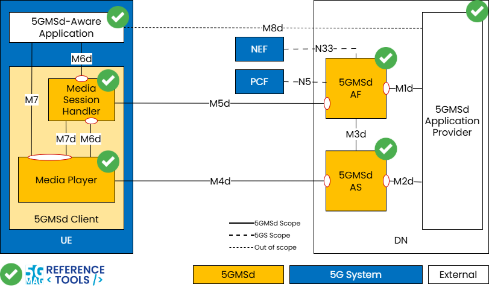
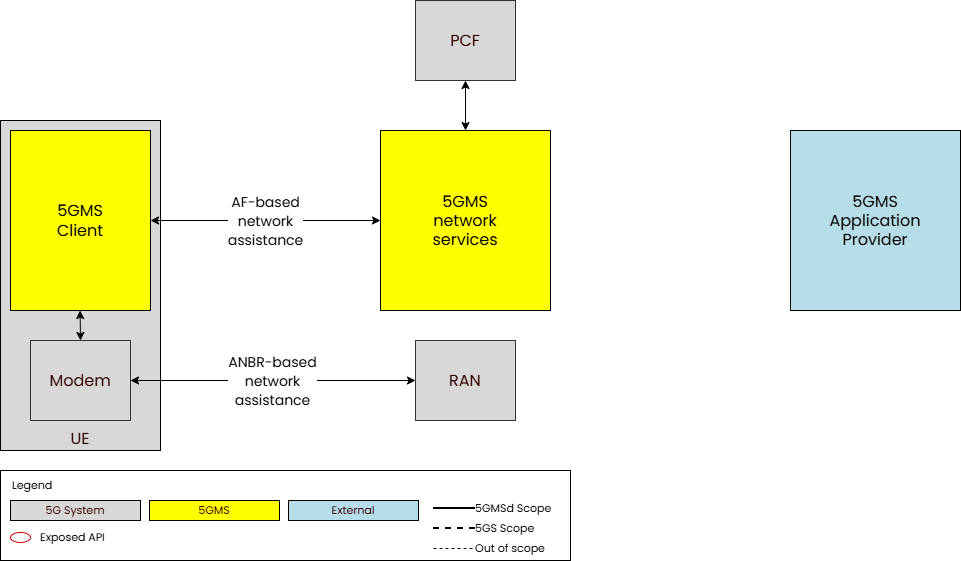
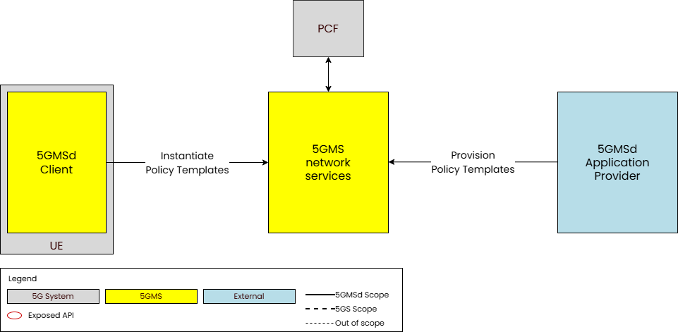
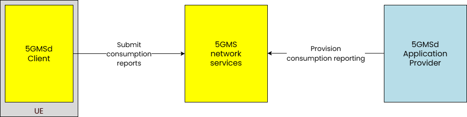
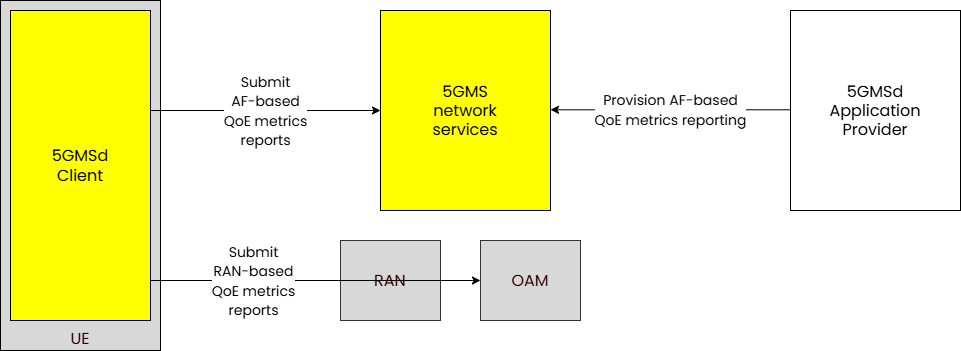

 

[Scope](./scope.html){: .btn .btn-blue } [Project Roadmap](./projects.html){: .btn .btn-blue } [GitHub Repos](./repositories.html){: .btn .btn-github } [Releases](../releases.html#project-5g-media-streaming){: .btn .btn-release } [Tutorials](./tutorials.html){: .btn .btn-blue } [Requirements](./requirements.html){: .btn .btn-blue }

# Scope

## 5G Media Streaming - An overview

In the context of 3GPP standards, 5G Media Streaming (5GMS) is defined as a framework designed to enable high-quality, efficient delivery of media. The architecture supports services from mobile network operators and third parties including both Downlink (5GMSd) and Uplink (5GMSu) Media Streaming. The 5GMS architecture is functionally divided into independent components enabling deployments with various degrees of integration between 5G MNOs and Content Providers.

5GMS is not a separate network but a functional extension of the standard 5G System Architecture. It is the bridge that allows 5G networks to move away from being a "data pipe" and instead become an active, optimized platform for professional and user-generated media content.

The main functional entities are:

* **5GMS Application Provider**: The entity that uses the 5G network to deliver content. It provides a 5GMS Aware-Application on the UE to make use of 5GMS Client and network functions via 5GMS interfaces and APIs.

* **5GMS Application Function (5GMS AF)**: A specialized application function dedicated to the management and optimization of media streaming sessions.

* **5GMS Application Server (5GMS AS)**:  A specialized application server which primary job is to store, cache, and deliver media content to the User Equipment (UE) or to receive and ingest media from the UE

* **5GMS Client**: The functional part of the user's device (UE) that handles the media session and the player/streamer logic.

A list of relevant specifications can be found in the link below.

[Specifications](https://hub.5g-mag.com/Standards/pages/5g-media-streaming.html){: .btn .btn-blue }

### 5G Unicast Downlink Media Streaming (5GMSd)

To deliver downlink streaming services, the network is the origin of the media and the UE acts as the consumption device.
 

The main functional entities are:

* **5GMSd Application Provider**: The external entity responsible for the "source" side of the media—creating, encoding, and formatting the content. It utilizes 5GMSd interfaces to deliver this media to the user's application.

* **5GMSd AS**: The hosting environment for media content. It can be a single server or a distributed network, such as a Content Delivery Network (CDN), to optimize delivery.

* **5GMSd AF**: The control-plane entity providing management functions to the device’s Media Session Handler and the Application Provider. It also acts as the bridge to the 5G Core, interacting with the PCF or NEF.

* **5GMSd Client**: The primary receiver on the device for downlink streaming services. It can be implemented with exposing APIs (M6d/M7d) for external use or as a self-contained entity where those interfaces are internal. It consists of two sub-components:

  * **Media Session Handler**: The "control brain" on the device. It coordinates with the 5GMSd AF to set up and manage sessions while gathering data like Quality of Experience (QoE) and consumption metrics.

  * **Media Player**: The "data engine" on the device. It communicates with the 5GMSd AS to fetch and play the actual media stream. It provides playback controls to the app and session status to the Session Handler.

* **5GMSd-Aware Application**: An external app (e.g., a streaming service) that holds the provider's specific logic. Uses standardized APIs to initiate and manage media sessions.

### Interfaces for 5GMSd

The interfaces are:

| Interface | Name | Description |
| :--- | :--- | :--- |
| **M1d** | **5GMSd Provisioning API** | External API exposed by the **5GMSd AF**; allows the Application Provider to configure the system for downlink streaming and receive feedback. |
| **M2d** | **5GMSd Ingest API** | Optional external API exposed by the **5GMSd AS**; used for uploading content when the AS is hosted within a trusted Data Network. |
| **M3d** | Internal Interface | An **unspecified internal API** used for information exchange between the 5GMSd AF and AS regarding content hosting. |
| **M4d** | **Media Streaming APIs** | The primary data-plane APIs exposed by the **5GMSd AS** to the **Media Player** for streaming media content. |
| **M5d** | **Media Session Handling API** | Control-plane APIs between the **5GMSd AF** and **Media Session Handler** for session control, QoE reporting, and security (auth/auth). |
| **M6d** | **UE Media Session Handling APIs** | Internal UE APIs that allow the **5GMSd-Aware App** and the **Media Player** to access 5GMS session functions. |
| **M7d** | **UE Media Player APIs** | Internal UE APIs used by the **5GMSd-Aware App** and **Session Handler** to control playback and media engine functions. |
| **M8d** | **Application API** | An external interface for "service-level" exchange (like metadata or login) between the **App** and the **Provider**. This is **not specified** by 3GPP. |

### Key Features for 5GMSd and APIs

The following features are defined for Downlink Media Streaming.

Feature | Description | Procedure | APIs 
--- | --- | --- | ---
**Content hosting** | 3GPP TS 26.501 4.0.2 | 3GPP TS 26.501 5.4 | 3GPP TS 26.510 + 26.512
**Network assistance** | 3GPP TS 26.501 4.0.5 | 3GPP TS 26.501 5.9 | 3GPP TS 26.510 + 26.512
**Dynamic policies** | 3GPP TS 26.501 4.0.6 | 3GPP TS 26.501 5.8 | 3GPP TS 26.510 + 26.512
**Consumption reporting** | 3GPP TS 26.501 4.0.8 | 3GPP TS 26.501 5.6 | 3GPP TS 26.510 + 26.512
**QoE metrics reporting** | 3GPP TS 26.501 4.0.9 | 3GPP TS 26.501 5.5 | 3GPP TS 26.510 + 26.512
**Edge processing** | 3GPP TS 26.501 4.0.10 | 3GPP TS 26.501 8 | 3GPP TS 26.510 + 26.512
**eMBMS delivery** | 3GPP TS 26.501 4.0.11 | 3GPP TS 26.501 5.10 | 3GPP TS 26.510 + 26.512
**Data collection, reporting and exposure** | 3GPP TS 26.501 5.11 | 3GPP TS 26.510 + 26.512

## What is being implemented? 

{: .inshort }
The functional entities of 5G Media Streaming, instantiated for 5G Unicast Downlink Media Streaming (5GMSd), including support for various of the features specified.

### Implementing 5G Unicast Downlink Media Streaming (5GMSd)

A functional 5GMSd implementation is available with the building blocks highlighted with the green tick below.

[Obtain the code in GitHub](./repositories.html){: .btn .btn-github }

[Check this Tutorial to deploy 5GMSd end-to-end](./tutorials/end-to-end.html){: .btn .btn-blue }

[Check this Tutorial to deploy 5GMSd end-to-end including a 5G Network](./tutorials/end-to-end-with-5g.html){: .btn .btn-blue }

[Check this Tutorial to test the 5GMS Application Function](./tutorials/testing-AS.html){: .btn .btn-blue }

[Check this Tutorial to deploy 5GMSd end-to-end including a 5G Network](./tutorials/testing-AF.html){: .btn .btn-blue }

### Feature: Content Hosting

[Obtain the code in GitHub](./repositories.html){: .btn .btn-github }

[Check this Tutorial to create an example Content Hosting Configuration](./tutorials/Content_Hosting.html){: .btn .btn-blue }

The content hosting feature provides a service equivalent to a Content Delivery Network (CDN) deployed inside or outside the Trusted DN.

The following are the reference points and interactions according to 3GPP TS 26.510.

Reference Point | Interactions | API Name | Description
--- | --- | --- | ---
M1 | 5.2.2 | [Provisioning Sessions API](https://jdegre.github.io/loader.html?yaml=TS26512_M1_ProvisioningSessions.yaml) | 8.2
M1 | 5.2.3 | [Content protocols discovery API](https://jdegre.github.io/loader.html?yaml=TS26512_M1_ContentProtocolsDiscovery.yaml) | 8.3
M1 | 5.2.4 | [Server Certificates provisioning API](https://jdegre.github.io/loader.html?yaml=TS26512_M1_ServerCertificatesProvisioning.yaml) | 8.4
M1 | 5.2.5 | [Content Preparation Templates provisioning API](https://jdegre.github.io/loader.html?yaml=TS26512_M1_ContentPreparationTemplatesProvisioning.yaml) | 8.5
M1 | 5.2.6 | [Edge Resources provisioning API](https://jdegre.github.io/loader.html?yaml=TS26512_M1_EdgeResourcesProvisioning.yaml) | 8.6
M1 | 5.2.7 | [Policy Templates provisioning API](https://jdegre.github.io/loader.html?yaml=TS26512_M1_PolicyTemplatesProvisioning.yaml) | 8.7
M1 | 5.2.8 | [Content Hosting provisioning API](https://jdegre.github.io/loader.html?yaml=TS26512_M1_ContentHostingProvisioning.yaml) | 8.8
M5 | 5.3.2 | [Service Access Information API](https://jdegre.github.io/loader.html?yaml=TS26512_M5_ServiceAccessInformation.yaml) | 9.2

## Feature: Network Assistance

The network assistance feature enables the 5GMS Client in the UE to interrogate or manipulate the network Quality of Service for an ongoing media streaming session. It defines two mechanisms for obtaining network assistance via interactions with the PCF (AF-based network assistance) or via ANBR signalling interactions between the UE modem and the RAN (ANBR-based network assistance). 

Both mechanisms allow to obtain:

* Bit Rate Recommendation (Throughput Estimation), which allows the 5GMS Client to stay synchronized with the network's current capabilities.
  * The Process: The client asks the 5GMS System for a bit rate estimate. The system then queries the Policy Control Function (PCF) to determine the available throughput for that specific session.
  * The Action: The client uses this data to proactively adjust its streaming speed—either by switching media quality levels (downlink).
  * The Benefit: It prevents stuttering and lag, ensuring a stable and consistent Quality of Experience (QoE) by staying within the network's "QoS envelope."

* Delivery Boost, which is a reactive feature used to request extra network performance when needed.
  * The Process: The client requests a temporary increase in bit rate. The 5GMS System asks the PCF to modify the session parameters to grant this extra capacity.
  * The Action: If the network has spare capacity, the boost is granted. The client uses this "boost" of speed to quickly refill a depleted buffer or finish a large file transfer faster.
  * The Benefit: It helps the user recover from potential playback interruptions or speeds up time-sensitive data tasks.

The following are the reference points and interactions according to 3GPP TS 26.510.

Reference Point | Interactions | API Name | Description
--- | --- | --- | ---
M5 | 5.3.2 | [Service Access Information API](https://jdegre.github.io/loader.html?yaml=TS26512_M5_ServiceAccessInformation.yaml) | 9.2
M5 | 5.3.4 | [Network Assistance API](https://jdegre.github.io/loader.html?yaml=TS26512_M5_NetworkAssistance.yaml) | 9.4

## Feature: Dynamic Policies

The dynamic policies feature enables the 5GMS Client in the UE to manipulate the network traffic handling policies for an ongoing media streaming session.

The following are the reference points and interactions according to 3GPP TS 26.510.

Reference Point | Interactions | API Name | Description
--- | --- | --- | ---
M1 | 5.2.2 | [Provisioning Sessions API](https://jdegre.github.io/loader.html?yaml=TS26512_M1_ProvisioningSessions.yaml) | 8.3
M1 | 5.2.7 | [Policy Templates provisioning API](https://jdegre.github.io/loader.html?yaml=TS26512_M1_PolicyTemplatesProvisioning.yaml) | 8.7
M5 | 5.3.2 | [Service Access Information API](https://jdegre.github.io/loader.html?yaml=TS26512_M5_ServiceAccessInformation.yaml) | 9.2
M5 | 5.3.3 | [Dynamic Policies API](https://jdegre.github.io/loader.html?yaml=TS26512_M5_DynamicPolicies.yaml) | 9.3

## Feature: Consumption Reporting

The consumption reporting feature allows consumption of downlink media streaming to be logged by the 5GMS System and exposed for analysis.

The following are the reference points and interactions according to 3GPP TS 26.510.

Reference Point | Interactions | API Name | API
--- | --- | --- | ---
M1 | 5.2.2 | [Provisioning Sessions API](https://jdegre.github.io/loader.html?yaml=TS26512_M1_ProvisioningSessions.yaml) | 8.3
M1 | 5.2.12 | [Consumption Reporting provisioning API](https://jdegre.github.io/loader.html?yaml=TS26512_M1_ConsumptionReportingProvisioning.yaml) | 8.12
M5 | 5.3.2 | [Service Access Information API](https://jdegre.github.io/loader.html?yaml=TS26512_M5_ServiceAccessInformation.yaml) | 9.2
M5 | 5.3.6| [Consumption Reporting API](https://jdegre.github.io/loader.html?yaml=TS26512_M5_ConsumptionReporting.yaml) | 9.6

## Feature: QoE Metrics Reporting

The QoE metrics reporting feature enables the 5GMS System to log and expose streaming performance data for further analysis.

The framework defines two distinct reporting paths:

* RAN-based Reporting: Metrics are sent to the Operations, Administration, and Maintenance (OAM) system via the Radio Access Network.

* AF-based Reporting: Metrics are sent directly to the network-side components (AF) of the 5GMS System.

The following are the reference points and interactions according to 3GPP TS 26.510.

Reference Point | Interactions | API Name | API
--- | --- | --- | ---
M1 | 5.2.2 | [Provisioning Sessions API](https://jdegre.github.io/loader.html?yaml=TS26512_M1_ProvisioningSessions.yaml) | 8.3
M1 | 5.2.11 | [Metrics Reporting provisioning API](https://jdegre.github.io/loader.html?yaml=TS26512_M1_MetricsReportingProvisioning.yaml) | 8.10
M5 | 5.3.2 | [Service Access Information API](https://jdegre.github.io/loader.html?yaml=TS26512_M5_ServiceAccessInformation.yaml) | 9.2
M5 | 5.3.5 | [Metrics Reporting API](https://jdegre.github.io/loader.html?yaml=TS26512_M5_MetricsReporting.yaml) | 9.5

## Feature: Data collection, reporting and exposure (TS 26.510)

The data collection, reporting and exposure feature enables the 5GMS System to log data relating to media streaming sessions and to expose this to 
subscribers in the form of Events.

The following are the reference points and interactions according to 3GPP TS 26.510.

Reference Point | Interactions | API Name | API
--- | --- | --- | ---
M1 | 5.2.13 | [Event Data Processing provisioning API](https://jdegre.github.io/loader.html?yaml=TS26512_M1_EventDataProcessingProvisioning.yaml) | 8.13
M5 | 5.3.5 | [Metrics Reporting API](https://jdegre.github.io/loader.html?yaml=TS26512_M5_MetricsReporting.yaml) | 9.5
M5 | 5.3.6 | [Consumption Reporting API](https://jdegre.github.io/loader.html?yaml=TS26512_M5_ConsumptionReporting.yaml) | 9.6

### Features supported by the 5GMS Application Function

The release versions of the 5GMSd Application Function support differing sets of interfaces, as described by the different
versions of the 3GPP specifications, and differing levels of feature support for those interfaces. The following attempts to capture
the feature sets and specification versions for each release, starting with the most recent release or upcoming releases.

#### Key

Where a feature of the specifications is supported the entry will be marked with &#x2611;, where it is being worked on and slated for the next release the feature will be marked with &#x270E; and where it is unimplemented in that
version the feature will be marked with &#x2610;.

<table><thead>
<tr><th>Interface reference point</th><th>Specifications & Versions</th><th>Protocols</th><th>Features</th></tr>
</thead>
<tbody>
<tr valign="top"><td>M1 (server)</td><td><ul>
  <li>TS 26.501 v17.6.0</li>
  <li>TS 26.512 v17.6.0</li>
</ul></td><td><ul>
  <li>&#x2611; HTTP/1.1</li>
  <li>&#x2610; HTTP/2.0</li>
  <li>&#x2611; HTTP/1.1 over SSL/TLS</li>
  <li>&#x2610; HTTP/2.0 over SSL/TLS</li>
</ul></td><td><ul>
  <li>&#x2611; Content Hosting Provisioning</li>
  <li>&#x2611; Content Protocols Discovery</li>
  <li>&#x2611; Provisioning Sessions</li>
  <li>&#x2611; Server Certificates Provisioning</li>
  <li>&#x2611; Consumption Reporting Provisioning</li>
  <li>&#x2610; Content Preparation Templates Provisioning</li>
  <li>&#x2610; Edge Resources Provisioning</li>
  <li>&#x2610; Event Data Processing Provisioning</li>
  <li>&#x2611; Metrics Reporting Provisioning</li>
  <li>&#x2611; Policy Templates Provisioning</li>
</ul></td></tr>
<tr valign="top"><td>M3 (client)</td><td><ul>
  <li>5G-MAG prototype</li>
</ul></td><td><ul>
  <li>&#x2611; HTTP/1.1</li>
  <li>&#x2611; HTTP/2.0</li>
  <li>&#x2611; HTTP/1.1 over SSL/TLS</li>
  <li>&#x2611; HTTP/2.0 over SSL/TLS</li>
</ul></td><td><ul>
  <li>&#x2611; Content Hosting Provisioning</li>
  <li>&#x2611; Server Certificates Provisioning</li>
</ul></td></tr>
<tr valign="top"><td>M5 (server)</td><td><ul>
  <li>TS 26.501 v17.6.0</li>
  <li>TS 26.512 v17.6.0</li>
</ul></td><td><ul>
  <li>&#x2611; HTTP/1.1</li>
  <li>&#x2610; HTTP/2.0</li>
  <li>&#x2611; HTTP/1.1 over SSL/TLS</li>
  <li>&#x2610; HTTP/2.0 over SSL/TLS</li>
</ul></td><td><ul>
  <li>&#x2611; Service Access Information</li>
  <li>&#x2611; Consumption Reporting</li>
  <li>&#x2611; Dynamic Policies 
      &nbsp; <b>Service Data Flow Description Methods:</b><ul>
    <li>&#x2610; 2 Tuple</li>
    <li>&#x2611; 5 Tuple</li>
    <li>&#x2610; ToS</li>
    <li>&#x2610; Flow Label</li>
    <li>&#x2610; Domain Name</li>
  </ul></li>
  <li>&#x2611; Metrics Reporting</li>
  <li>&#x2611; Network Assistance<ul>
    <li>&#x2610; Throughput Estimation</li>
    <li>&#x2611; Delivery Boost</li>
  </ul></li>
</ul></td></tr>
<tr valign="top"><td>N5 (Npcf client/server)</td><td><ul>
  <li>TS 29.514 v17.8.0</li>
</ul></td><td><ul>
  <li>&#x2611; HTTP/2.0</li>
  <li>&#x2611; HTTP/2.0 over SSL/TLS</li>
</ul></td><td><ul>
  <li>&#x2611; Policy Authorization</li>
  <li>&#x2611; Policy Authorization Notifications</li>
</ul></td></tr>
<tr valign="top"><td>N33 (client)</td><td><ul>
  <li>TS 29.591 v17.9.0</li>
</ul></td><td><ul>
  <li>&#x2610; HTTP/2.0</li>
  <li>&#x2610; HTTP/2.0 over SSL/TLS</li>
</ul></td><td><ul>
  <li>&#x2610; Event Exposure</li>
</ul></td></tr>
<tr valign="top"><td>R4 (server)</td><td><ul>
  <li>TS 26.512 v17.6.0</li>
</ul></td><td><ul>
  <li>&#x2610; HTTP/1.1</li>
  <li>&#x2610; HTTP/2.0</li>
  <li>&#x2610; HTTP/1.1 over SSL/TLS</li>
  <li>&#x2610; HTTP/2.0 over SSL/TLS</li>
</ul></td><td><ul>
  <li>&#x2610; Media Streaming Access</li>
</ul></td></tr>
<tr valign="top"><td>R5/R6 (client/server)</td><td><ul>
  <li>TS 26.512 v17.6.0</li>
  <li>TS 29.517 v17.9.0</li>
</ul></td><td><ul>
  <li>&#x2610; HTTP/1.1</li>
  <li>&#x2610; HTTP/2.0</li>
  <li>&#x2610; HTTP/1.1 over SSL/TLS</li>
  <li>&#x2610; HTTP/2.0 over SSL/TLS</li>
</ul></td><td><ul>
  <li>&#x2610; Media Streaming QoE Event</li>
  <li>&#x2610; Media Streaming Consumption Event</li>
  <li>&#x2610; Media Streaming Network Assistance Invocation Event</li>
  <li>&#x2610; Media Streaming Dynamic Policy Invocation Event</li>
  <li>&#x2610; Media Streaming Access Event</li>
  <li>&#x2610; Event Subscription</li>
</ul></td></tr>
<tr valign="top"><td>Nbsf (client)</td><td><ul>
  <li>TS 29.513 v17.10.0</li>
  <li>TS 29.521 v17.8.0</li>
</ul></td><td><ul>
  <li>&#x2611; HTTP/2.0</li>
  <li>&#x2611; HTTP/2.0 over SSL/TLS</li>
</ul></td><td><ul>
  <li>&#x2611; Binding Information Retrieval</li>
</ul></td></tr>
</tbody>
<tfoot>
<!--<tr><td colspan="4"><b>Notes:</b> 1: Only the Delivery Boost feature of Network Assistance is implemented, the Throughput Estimation feature is still in development.</td></tr> -->
</tfoot>
</table>

### Supported APIs for 5G Media Streaming

## Relevant specifications
The table contains the 3GPP 5G Media Streaming APIs for Release 17 (TS 26.512) and Release 18 (TS 26.510 & TS 26.512). Note that the current reference implementation of the 5GMSd AF and 5GMSd AS are based on Release 17 (TS 26.510 does not exist in Release 17). In Release 18, the media session handling APIs were moved from TS 26.512 into TS 26.510 to generalise them to support the Real-Time media Communication (RTC) System as well as the 5G Media Streaming (5GMS) System.
More information about the relevant specifications can be found in the following pages:
 - 5G Media Streaming Architecture: [Standards pages](https://5g-mag.github.io/Standards/pages/5g-media-streaming.html)
 - UE Data Collection and Event Exposure: [Standards pages](https://5g-mag.github.io/Standards/pages/data-collection-event-exposure.html)

### Classification

 Release 17 | Release 18
 ---------- | ----------
 TS26512_CommonData.yaml 	| TS26510_CommonData.yaml, TS26512_CommonData.yaml |
 TS26512_M1_ConsumptionReportingProvisioning.yaml  | TS26510_Maf_Provisioning_ConsumptionReporting.yaml
 TS26512_M1_ContentHostingProvisioning.yaml  | TS26510_Maf_Provisioning_ContentHosting.yaml
 TS26512_M1_ContentPreparationTemplatesProvisioning.yaml | TS26510_Maf_Provisioning_ContentPreparationTemplates.yaml
 TS26512_M1_ContentProtocolsDiscovery.yaml  |	TS26510_Maf_Provisioning_ContentProtocols.yaml
 TS26512_M1_EdgeResourcesProvisioning.yaml | TS26510_Maf_Provisioning_EdgeResources.yaml
 TS26512_M1_EventDataProcessingProvisioning.yaml | TS26510_Maf_Provisioning_EventDataProcessing.yaml
 TS26512_M1_MetricsReportingProvisioning.yaml  | TS26510_Maf_Provisioning_MetricsReporting.yaml
 TS26512_M1_PolicyTemplatesProvisioning.yaml  | TS26510_Maf_Provisioning_PolicyTemplates.yaml
 TS26512_M1_ProvisioningSessions.yaml  | TS26510_Maf_Provisioning_ProvisioningSessions.yaml
 TS26512_M1_ServerCertificatesProvisioning.yaml  | TS26510_Maf_Provisioning_ServerCertificates.yaml
 N/A | TS26510_Maf_Provisioning_ContentPublishing.yaml
 N/A | TS26510_Maf_Provisioning_RealTimeCommunication.yaml
 TS26512_M5_ConsumptionReporting.yaml  | TS26510_Maf_SessionHandling_ConsumptionReporting.yaml
 TS26512_M5_DynamicPolicies.yaml  | TS26510_Maf_SessionHandling_DynamicPolicy.yaml
 TS26512_M5_MetricsReporting.yaml  | TS26510_Maf_SessionHandling_MetricsReporting.yaml
 TS26512_M5_NetworkAssistance.yaml  | TS26510_Maf_SessionHandling_NetworkAssistance.yaml
 TS26512_M5_ServiceAccessInformation.yaml  | TS26510_Maf_SessionHandling_ServiceAccessInformation.yaml
 PreStd* | TS26512_Mas_Configuration_ContentHosting.yaml
 PreStd* | TS26512_Mas_Configuration_ContentPreparationTemplates.yaml
 PreStd* | TS26512_Mas_Configuration_ContentPublishing.yaml
 PreStd* | TS26512_Mas_Configuration_ServerCertificates.yaml
 N/A | TS26512_R2_DataReporting.yaml
 TS26512_R4_DataReporting.yaml | TS26512_R4_DataReporting.yaml
 N/A | TS26512_EventExposure.yaml

### Legend

TEXT = Already implemented in 5G-MAG Reference Tools

TEXT = In the implementation roadmap in 5G-MAG Reference Tools

PreStd* = Implementatio of a pre-standardisation variant of the 5GMS AS configuration API at reference point M3d that is similar to what eventually appeared in Release 18. The service name is different and so are some details.
 
{: .note }
Note that not all aspects of these APIs are implemented. For example Content Preparation, Edge resources, Geo-fencing and URL signing in TS26512_M1_ContentHostingProvisioning.yaml are not implemented.

# High-level architectures

## 5G Downlink Media Streaming (5GMSd)

[5G Media Streaming: Repositories](../5g-media-streaming/repositories.html){: .btn .btn-5gms }
[3GPP RAN and Core Platforms: Repositories](../3gpp-ran-and-core-platforms/repositories.html){: .btn .btn-3gpp }
[Common Tools: Repositories](../common-tools/){: .btn .btn-common }

## 5G Downlink Media Streaming (5GMSd) with UE Data Collection Reporting and Event Exposure

[5G Media Streaming: Repositories](../5g-media-streaming/repositories.html){: .btn .btn-5gms }
[UE Data Collection, Reporting and Event Exposure: Repositories](../ue-data-collection-reporting-exposure/repositories.html){: .btn .btn-uedc }
[3GPP RAN and Core Platforms: Repositories](../3gpp-ran-and-core-platforms/repositories.html){: .btn .btn-3gpp }
[Common Tools: Repositories](../common-tools/){: .btn .btn-common }

## 5G Downlink Media Streaming (5GMSd) with 5GC Service Consumers

[5G Media Streaming: Repositories](../5g-media-streaming/repositories.html){: .btn .btn-5gms }
[5GC Service Consumers: Repositories](../5g-core-service-consumers/repositories.html){: .btn .btn-5gcsc }
[3GPP RAN and Core Platforms: Repositories](../3gpp-ran-and-core-platforms/repositories.html){: .btn .btn-3gpp }
[Common Tools: Repositories](../common-tools/){: .btn .btn-common }

## 5G Downlink Media Streaming (5GMSd) over eMBMS

[5G Media Streaming: Repositories](../5g-media-streaming/repositories.html){: .btn .btn-5gms }
[5G Broadcast: Repositories](../lte-based-5g-broadcast/repositories.html){: .btn .btn-5gbc }
[Multimedia content delivery protocols: Repositories](../multimedia-content-delivery/repositories.html){: .btn .btn-md }
[3GPP RAN and Core Platforms: Repositories](../3gpp-ran-and-core-platforms/repositories.html){: .btn .btn-3gpp }
[Common Tools: Repositories](../common-tools/){: .btn .btn-common }

# Docker deployment support
Docker-Compose setups are provided to run the 5GMS Application Function, the 5GMS Application Server and the 5GMS Application Provider in Docker container environments.

[5G Media Streaming: Repositories](../5g-media-streaming/repositories.html){: .btn .btn-5gms }
