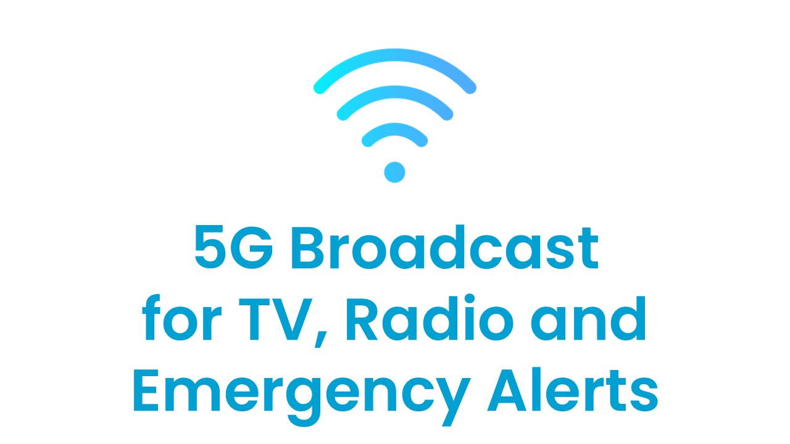
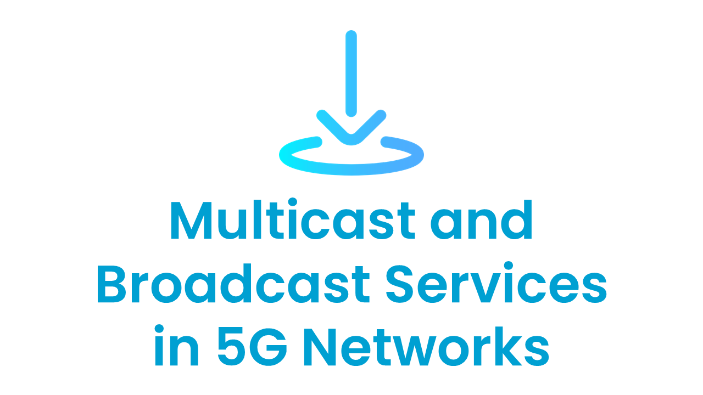
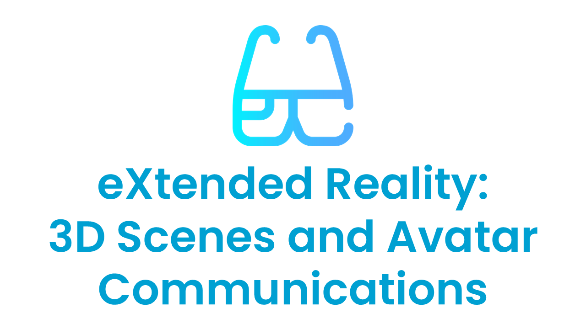
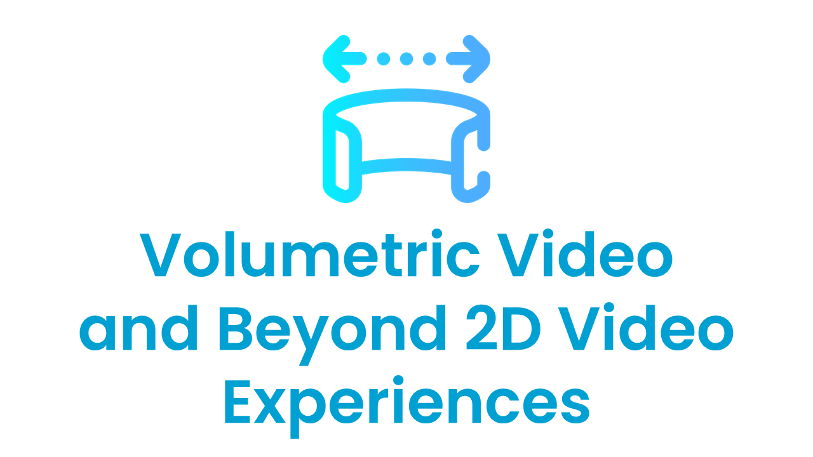
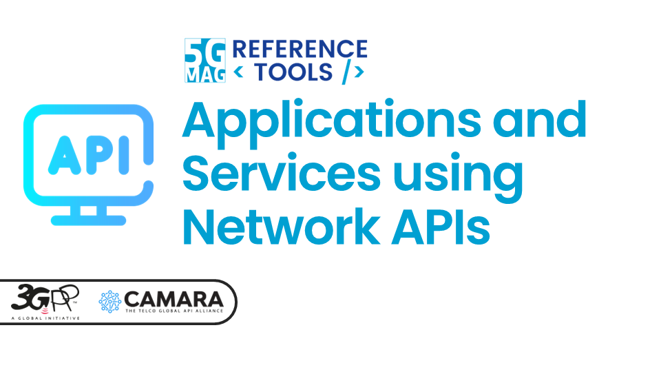

 

# Build an application

### I'd like to setup my application in the domain of... (please select below).

<table>
  <tr>
    <td markdown="span" align="center" width="33%"><a href="./streaming.html"><a/></td>
    <td markdown="span" align="center" width="33%"><a href="./5gbroadcast.html"><a/></td>
    <td markdown="span" align="center" width="33%"><a href="./multicastbroadcast.html"><a/></td>
  </tr>
  <tr>
    <td markdown="span" align="center" width="33%">[Streaming, Media Delivery and Data Collection](./streaming.html){: .btn .btn-blue }</td>
    <td markdown="span" align="center" width="33%">[5G Broadcast for TV, Radio and Emergency Alerts](./5gbroadcast.html){: .btn .btn-blue }</td>
    <td markdown="span" align="center" width="33%">[Multicast and Broadcast Services in 5G Networks](./multicastbroadcast.html){: .btn .btn-blue }</td>
  </tr>
    <td> </td>
  <tr>
    <td markdown="span" align="center" width="33%"><a href="./xr.html"><a/></td>
    <td markdown="span" align="center" width="33%"><a href="./volumetric.html"><a/></td>
    <td markdown="span" align="center" width="33%"><a href="./networkapis.html"><a/></td>
  </tr>
  <tr>
    <td markdown="span" align="center" width="33%">[eXtended Reality (XR): 3D Scenes and Avatar Communications](./xr.html){: .btn .btn-blue }</td>
    <td markdown="span" align="center" width="33%">[Volumetric Video and Beyond 2D Video Experiences](./volumetric.html){: .btn .btn-blue }</td>
    <td markdown="span" align="center" width="33%">[Applications and Services using Network APIs](./networkapis.html){: .btn .btn-blue }</td>
  </tr>
</table>
