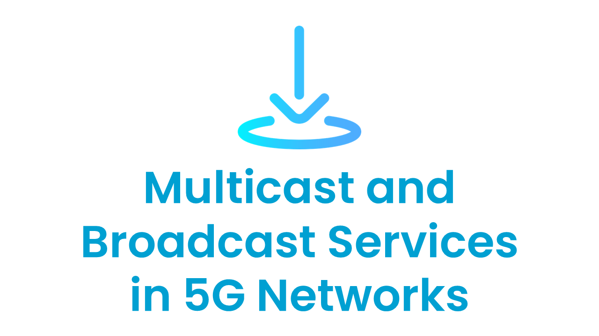
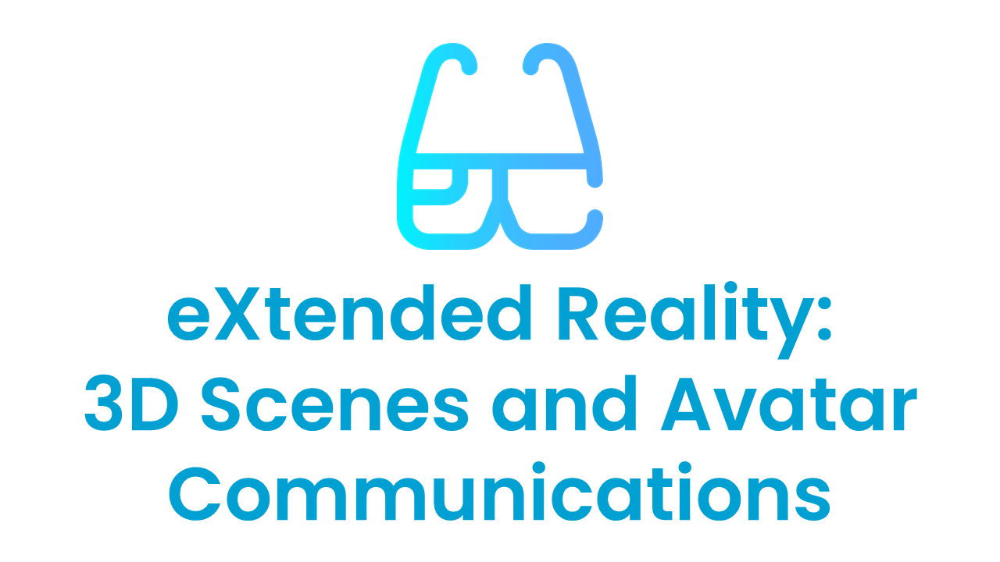
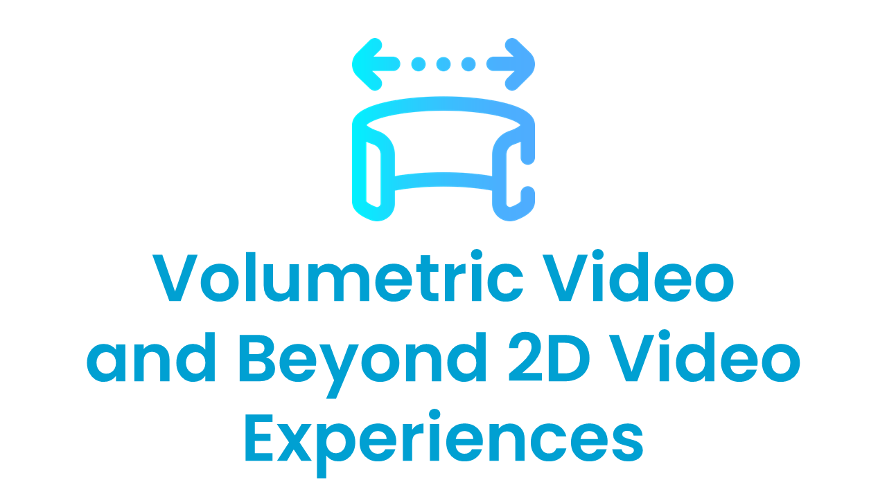
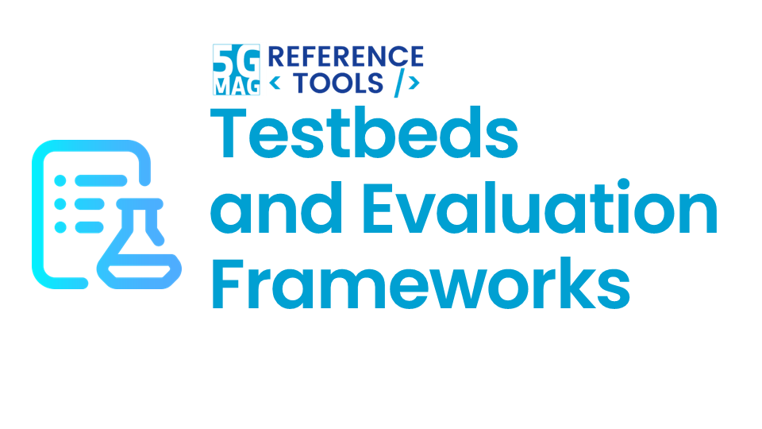
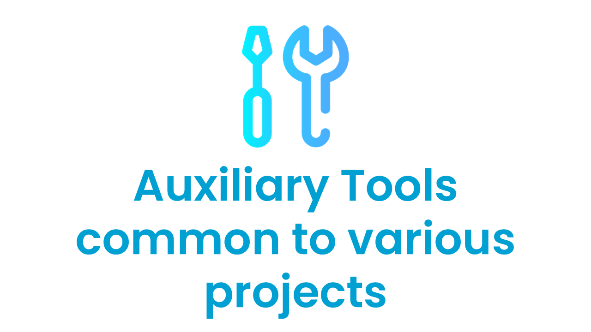
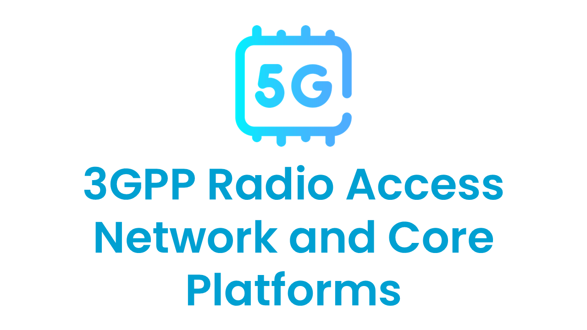
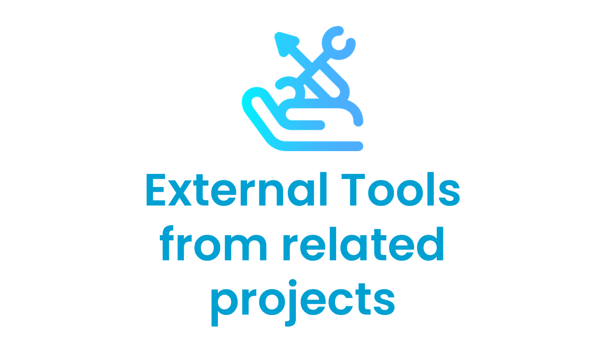

 

# Focus Areas

<table>
  <tr>
    <td markdown="span" align="center"><a href="./streaming.html"><a/></td>
    <td markdown="span" align="center"><a href="./5gbroadcast.html"><a/></td>
    <td markdown="span" align="center"><a href="./multicastbroadcast.html"><a/></td>
  </tr>
  <tr>
    <td markdown="span" align="center">[Streaming, Media Delivery and Data Analytics](./projects.html#content-delivery-streaming-and-data-analytics){: .btn .btn-blue }</td>
    <td markdown="span" align="center">[5G Broadcast for TV, Radio and Emergency Alerts](./projects.html#5g-broadcast-for-tv-radio-and-emergency-alerts){: .btn .btn-blue }</td>
    <td markdown="span" align="center">[Multicast and Broadcast Services in 5G Networks](./projects.html#multicast-and-broadcast-services-in-5g-networks){: .btn .btn-blue }</td>
  </tr>
    <td> </td>
  <tr>
    <td markdown="span" align="center"><a href="./xr.html"><a/></td>
    <td markdown="span" align="center"><a href="./volumetric.html"><a/></td>
    <td markdown="span" align="center"><a href="./testbeds.html"><a/></td>
  </tr>
  <tr>
    <td markdown="span" align="center">[eXtended Reality (XR): 3D Scenes and Avatar Communications](./projects.html#extended-reality-xr-3d-scenes-and-avatar-communications){: .btn .btn-blue }</td>
    <td markdown="span" align="center">[Volumetric Video and Beyond 2D Video Experiences](./projects.html#volumetric-video-and-beyond-2d-video-experiences){: .btn .btn-blue }</td>
    <td markdown="span" align="center">[Test-beds and Evaluation Frameworks](./projects.html#test-beds-and-evaluation-frameworks){: .btn .btn-blue }</td>
  </tr>
    <td> </td>
  <tr>
    <td markdown="span" align="center"><a href="./projects.html#auxiliary-tools-common-to-various-projects"><a/></td>
    <td markdown="span" align="center"><a href="./projects.html#3gpp-ran-and-core-platforms"><a/></td>
    <td markdown="span" align="center"><a href="./projects.html#external-tools"><a/></td>
  </tr>
  <tr>
    <td markdown="span" align="center">[Auxiliary Tools common to various projects](./projects.html#auxiliary-tools-common-to-various-projects){: .btn .btn-blue }</td>
    <td markdown="span" align="center">[3GPP RAN and Core Platforms](./projects.html#3gpp-ran-and-core-platforms){: .btn .btn-blue }</td>
    <td markdown="span" align="center">[External Tools from related projects](./projects.html#external-tools){: .btn .btn-blue }</td>
  </tr>
</table>

### Auxiliary tools common to various projects
[Documentation](./common-tools/index.html){: .btn .btn-blue }
[Latest Releases](./releases.html#auxiliary-tools-common-to-various-projects){: .btn .btn-blue }

### 3GPP RAN and Core Platforms
[Documentation](./3gpp-ran-and-core-platforms/index.html){: .btn .btn-blue }

### External Tools
[Documentation](./external-tools/index.html){: .btn .btn-blue }
