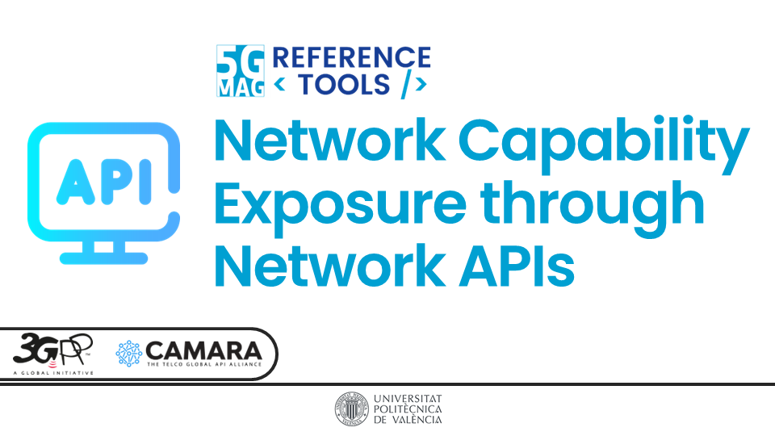

 

# Applications and Services using Network APIs

<table>
  <tr>
    <td markdown="span" align="center"><a href="./network-apis/"><a/></td>
    <td markdown="span" align="center"><a href=""><a/></td>
  </tr>
  <tr>
    <td markdown="span" align="center">[Project Documentation](./network-apis/){: .btn .btn-blue } [Project Roadmap](https://github.com/orgs/5G-MAG/projects/48/views/19){: .btn .btn-blue }</td>
    <td markdown="span" align="center"></td>
  </tr>
</table>
